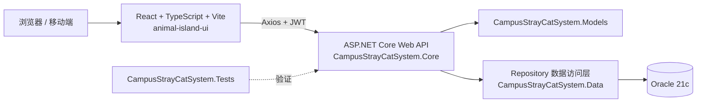

# Campus Stray Cat DBMS
<p align="center">
    
</p>

<p align="center">
    
    
    
    
    
    
    
    
    
</p>

校园流浪猫管理系统（Campus Stray Cat DBMS）是一个面向校园流浪猫救助、TNR、医疗、领养、志愿服务和财务公示的全栈课程项目。

后端使用 ASP.NET Core Web API 连接 Oracle 21c，前端使用 React + TypeScript + Vite，并采用 `animal-island-ui` 作为统一视觉组件库。系统通过 JWT 和角色权限控制不同用户可访问的页面与操作。

此为同济大学软件工程专业数据库课程设计项目，旨在展示数据库设计、建模、SQL、Web API 和前端界面的综合实现能力。项目包含数据库结构定义、数据插入脚本、接口文档、前端页面规划以及相关测试说明。

## 项目定位和功能范围

本项目是一个面向校园流浪猫救助工作的综合管理系统，目标是把猫咪档案、校园位置、救助流程和志愿服务统一到一个系统中，形成可查询、可追踪、可公示的管理记录。

主要功能范围包括：

- 猫咪档案、照片、特征、目击记录和校园区域管理
- TNR 救助案例、状态流转、医疗记录和护理提醒
- 紧急救助上报、猫咪失踪预警和命名投票
- 领养申请、审核回访、志愿者排班、投喂签到和任务交接
- 众筹项目、捐赠、支出、财务公示和统计报表
- 用户、角色、权限和领养黑名单管理

## 系统架构



前端负责页面、交互和角色菜单；`Core` 负责 API、鉴权和业务流程；`Data` 负责 Oracle 连接及 SQL/存储过程调用；`Models` 提供各层共享的数据模型；`Tests` 用于验证关键接口和业务行为。

## 技术栈

| 层次 | 技术 |
| --- | --- |
| 数据库 | Oracle 21c、PL/SQL |
| 后端 | .NET 8、ASP.NET Core Web API |
| 数据访问 | Repository、Oracle SQL |
| 鉴权 | JWT Bearer、角色权限控制 |
| 前端 | React 18、TypeScript、Vite |
| 前端状态与请求 | Zustand、Axios |
| UI | animal-island-ui、Less/CSS Modules |

## 文档入口

- [前端页面分工与开发说明](docs/frontend_page_assignments.md)
- [A 组用户与权限接口文档](docs/A组_用户与权限接口文档.md)
- [B 组猫咪档案与校园位置接口文档](docs/B组_猫咪档案与校园位置接口文档.md)
- [C 组救助、TNR 与医疗接口文档](docs/C组_救助TNR与医疗接口文档.md)
- [D 组领养、志愿者、投喂与财务接口文档](docs/D组_领养志愿者投喂财务接口文档.md)

## 项目结构

```text
.
├── assets/                          # 图片、演示素材
├── database/                        # 建表、删表、示例数据、查询脚本
├── docs/                            # 需求、接口、系统设计和前端规划文档
├── scripts/                         # 本地运行与环境说明
└── src/                             # 应用源码
    ├── CampusStrayCatSystem.App/    # React + Vite 前端界面
    ├── CampusStrayCatSystem.Core/   # ASP.NET Core API、鉴权和业务流程
    ├── CampusStrayCatSystem.Data/   # Oracle Repository 和数据访问
    ├── CampusStrayCatSystem.Models/ # 实体、请求模型和响应模型
    └── CampusStrayCatSystem.Tests/  # 接口和关键业务测试
```

运行命令：

```powershell
dotnet run --project src/CampusStrayCatSystem.Core/CampusStrayCatSystem.Core.csproj --launch-profile http
```

前端开发：

```powershell
cd src/CampusStrayCatSystem.App
npm install
npm run dev
```
