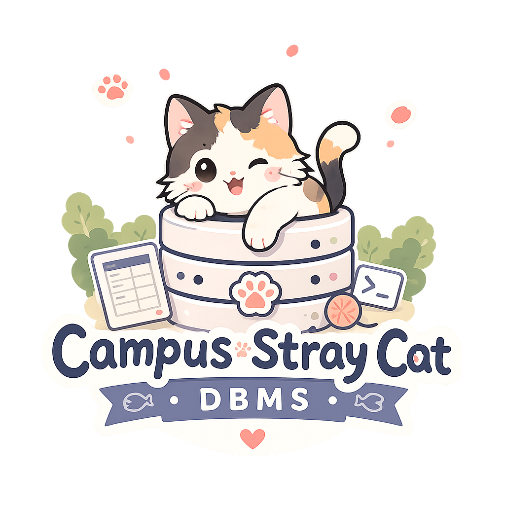

# Campus Stray Cat DBMS
<p align="center">
    
</p>

<p align="center">
    
    
    
</p>

校园流浪猫管理系统的数据库管理系统（DBMS）项目，使用 Oracle 21c 数据库和 SQL 语言进行开发。该项目旨在提供一个完整的数据库解决方案，用于管理校园内的流浪猫信息，包括猫咪的基本信息、健康状况、领养记录等。

此为2024同济大学软件工程专业某小组数据库课程设计的项目，旨在展示数据库设计、建模和管理的能力。项目包含了完整的数据库结构定义、数据插入脚本以及相关的操作说明。

## 项目结构

```text
.
├── assets/                      # 图片、演示素材
├── database/                    # 建表、删表、示例数据、查询脚本
├── docs/                        # 需求、数据库说明、系统设计文档
├── scripts/                     # 本地运行与环境说明
└── src/                         # C# 应用源码
    ├── CampusStrayCatSystem.App/    # 界面层
    ├── CampusStrayCatSystem.Core/   # 业务逻辑层
    ├── CampusStrayCatSystem.Data/   # 数据访问层
    ├── CampusStrayCatSystem.Models/ # 数据模型
    └── CampusStrayCatSystem.Tests/  # 测试代码
```

